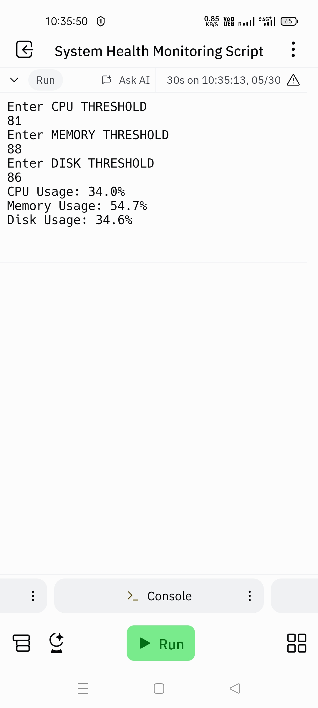

# System Health Monitoring
# Description

This Python script monitors the system's CPU, memory, and disk usage, and sends email alerts if any of these resources exceed a specified threshold. It utilizes the `psutil` library to retrieve system information and the `smtplib` module to send emails.

# Requirements

- Python 3.x
- psutil library 

# Usage

1. Run the script.
2. Enter the desired CPU, memory, and disk usage thresholds when prompted.
3. The script will continuously monitor the system resources and send email alerts if any threshold is exceeded.
4. The current CPU, memory, and disk usage percentages will be printed to the console every minute

# Output

The successful completion of the above program is displayed by the below screenshot,

